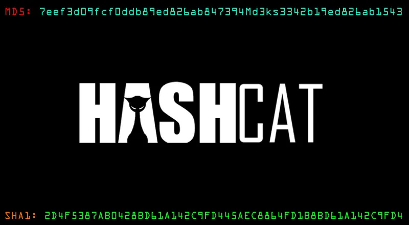

# __OVERVIEW
this post highlights the power of custom wordlists, Instead of relying on generic, multi-gigabyte wordlists, we will perform a **targeted attack**. The strategy is to use Open Source Intelligence (OSINT) to create a custom wordlist and ruleset tailored specifically to our victim.
We can use Hashcat to combine lists of potential names and labels with specific mutation rules to create custom wordlists.
<!-- more -->


Hashcat uses a specific syntax to define characters, words, and their transformations. The complete syntax is documented in the official [Hashcat rule-based attack documentation](https://hashcat.net/wiki/doku.php?id=rule_based_attack), but the examples below are sufficient to understand how Hashcat mutates input words.

| **Function** | **Description**                                              |
| ------------ | ------------------------------------------------------------ |
| `:`          | Do nothing                                                   |
| `l`          | Lowercase all letters                                        |
| `u`          | Uppercase all letters                                        |
| `c`          | Capitalize the first letter and lowercase others             |
| `sXY` (leet) | Replace all instances of X with Y                            |
| `$!`         | Add the exclamation character at the end                     |
| $0, $9       | appends numbers                                              |
| $1$9$9$8     | translates to 1998                                           |
| `t`          | Toggle the case of all characters in word p@ssW0rd->P@SSw0RD |


Each rule is written on a new line and determines how a given word should be transformed. If we write the functions shown above into a file, it may look like this:


We can use the following command to apply the rules in `custom.rule` to each word in `password.list` and store the mutated results in `mut_password.list`.

```shell
$ hashcat --force password.list -r custom.rule --stdout | sort -u > mut_password.list
```

password cracking and the creation of custom wordlists are, in most cases, a guessing game. We can narrow this down and perform more targeted guessing if we have information about the password policy, while considering factors such as the company name, geographical region, industry, and other topics or keywords that users might choose when creating their passwords. Exceptions, of course, include cases where passwords have been leaked and directly obtained.
## Generating wordlists using CeWL

We can use a tool called [CeWL](https://github.com/digininja/CeWL) to scan potential words from a company's website and save them in a separate list. We can then combine this list with the desired rules to create a customized password list—one that has a higher probability of containing the correct password for an employee. We specify some parameters, like the depth to spider (`-d`), the minimum length of the word (`-m`), the storage of the found words in lowercase (`--lowercase`), as well as the file where we want to store the results (`-w`).

Writing Custom Wordlists and Rules

```shell
$ cewl https://www.echoridge.com -d 4 -m 6 --lowercase -w inlane.wordlist
magdy3660@htb[/htb]$ wc -l inlane.wordlist

326
```

Welcome to this hands-on lab where we'll crack a password hash by building a targeted wordlist. Instead of relying on generic, multi-gigabyte wordlists, we will perform a **targeted attack**. This highly effective strategy uses Open Source Intelligence (OSINT) to create a custom wordlist and ruleset tailored specifically to our victim.

This exercise will show you how to combine intelligence gathering with the power of `cuppy` and `hashcat` to compromise a password under a corporate policy.
# SECTION EXERCISE
### The Scenario

Imagine we have compromised a password hash from the work email of a target named **Mark White**. Through some basic OSINT, we've gathered the following details:

- **Name:** Mark White
- **Birth Date:** August 5, 1998
- **Employer:** Nexura, Ltd.
- **Company Password Policy:**
    - Minimum 12 characters
    - At least one uppercase letter
    - At least one lowercase letter
    - At least one number
    - At least one symbol
- **Location:** San Francisco, CA, USA
- **Personal Details:**
    - Wife: `Maria`
    - Son: `Alex`
    - Pet Cat: `Bella`
    - Hobby: `baseball`

**The Target Hash (MD5):** `97268a8ae45ac7d15c3cea4ce6ea550b`

# Generating a Base Wordlist with `cuppy`

first we need to convert our OSINT data into a list of potential password keywords. The **Common User Passwords Profiler (`cuppy`)** is the perfect tool for this job. It takes personal information as input and generates a wordlist based on common patterns.

let's say we found a user through OSINT, 'Mark stenzen' In this case, we've gathered some details about Mark aside from his full name and the company he works for, we can add every bit of details to our list generation process. using cuppy we'll start of by supply the full name, followed by company, personal details, hobbies, keywords etcetra:

```shell

# running `cuppy` in interactive mode and enter the information we gathered about Mark.

cuppy -i 
```
by now, cuppy should have generated a candidate password list with multiple combinations,
```shell
$ wc -l mark.txt 
16797 mark.txt
```
In the following section, I'll guide you towards  further enhancing the potential of the passwords list using custom hashcat.

# Enhancing the password list with  Custom hashcat rules

We'll create a file named `custom.rule` to add the required complexity (capitalization, numbers, symbols).

Instead of only guessing the most obvious pattern, we'll create a broader set of rules. This will generate a very large number of candidates, increasing our chances of success if the user chose a slightly less common pattern.

Here is an example of a more comprehensive `custom.rule` file. It includes capitalization, leetspeak substitutions (`s` for `$`, `a` for `@`), and appending various years and symbols.

```
# custom.rule - A broad ruleset for our target

# --- SECTION 1: Simple capitalization and appending year/symbol ---
# Creates passwords like: Baseball1998!
c $1$9$9$8$!
c $1$9$9$8$#
c $1$9$9$8$@

# --- SECTION 2: Toggle case and add years/symbols ---
# Creates passwords like: bASEBALL1998!
t $1$9$9$8$!
t $1$9$9$8$#

# --- SECTION 3: Leetspeak (Character Substitution) ---
# Creates passwords like: M@ri@1998!, B@seb@ll2025#
c sa@ $1$9$9$8$!


# --- SECTION 4: Combined leetspeak ---
# Creates passwords like: B@$eb@ll98!
c sa@ ss$ $9$8$!
```
_Note: Your own rule file might be much larger to generate all the possibilities._
###  Applying Rules and Filtering the Wordlist

Now, let's apply our `custom.rule` file to the `mark.txt` wordlist. We'll use `hashcat` with the `--stdout` flag to output all the generated password candidates and save them to a new file. The `sort -u` command removes any duplicates.
```
hashcat --force mark.txt -r custom.rule --stdout | sort -u > mut_password.list
```
This process will create a huge list of mutated passwords. Let's see the result.

```shell
$ cat mut_password.list | grep -E '^.{12,}$' | grep -E '[A-Z]+[a-z]+' | sort -u > 12ormore.txt
```
- `grep -E '^.{12,}$'` finds all lines with 12 or more characters.
- `grep -E '[A-Z]+[a-z]+'` ensures there's at least one uppercase letter followed by a lowercase, a common pattern for capitalization.

This filtering step is crucial for reducing the noise
```
$ wc -l 12ormore.txt
190239 12ormore.txt
```

We are now left with a final list of over 190,000 strong candidates that are much more likely to be correct. Let's peek at the first few lines to ensure they look right.
```shell
$ head -n 3 12ormore.txt
Alex1998!@#$
Alex1998!@#$
Alex1998!@#$
```
### Cracking the Hash

This is the moment of truth. We will now use our final, filtered wordlist (`12ormore.txt`) against the target hash.
```shell
$ hashcat -m 0 97268a8ae45ac7d15c3cea4ce6ea550b 12ormore.txt
```

**Result:**
Once `hashcat` finishes, its status will show `Cracked`. To view the plaintext password you just discovered, use the `--show` flag.
```shell
$ hashcat -m 0 97268a8ae45ac7d15c3cea4ce6ea550b --show 97268a8ae45ac7d15c3cea4ce6ea550b:Ba******!
```

(full doc:https://hashcat.net/wiki/doku.php?id=rule_based_attack)


```shell
 --- SECTION 3: Leetspeak (Character Substitution) --- 
 Creates passwords like: M@ri@1998!, B@seb@ll2025# # Very effective for corporate environments trying to enforce "complex" passwords.
c s a @ $1$9$9$8$! 
c s e 3 $1$9$9$8$! c s i 1 $1$9$9$8$! c s o 0 $1$9$9$8$!
c s a @ $2$0$2$5$# 
c s s $ $2$0$2$5$@ # Combined leetspeak c s a @ s i 1 $1$9$9$8$! c s a @ s o 0 $9$8$#
```
so when writing the rules, they  would look like this:
```
Creates passwords like: Baseball1998!,
c $1$9$9$8$@ -> Nexura2025@
c $!$1$9$9$8 -> Abdo!1998
c $1$9$9$8$! -> Abdo1998!
```

apply the rule to the  wordlist:
```shell-session
$ hashcat --force password.list -r custom.rule --stdout | sort -u > mut_password.list
```
hmm, lets see how many words we have
```
$ wc -l mut_password.list 
231238 mut_password.list
```
now lets further customize it for our password policy since there maybe huge amount of junk that wouldn't work, by grepping for words with 12 or more characters:
```
$ cat mut_password.list | grep -E '^.{12,}$' | grep -E '[A-Z]+[a-z]+' | sort -u > 12ormore.txt

$ wc -l 12ormore.txt 
190239 12ormore.txt
```
okay but how does each word look like?
```
$ head -n 50 12ormore.txt 
'#''#'$Alex98!
'#'$'#'Alex98!
$'#''#'Alex98!
'#''#'$Bella98!
```
i kept it this way as mark may have set the symbols firstly, but the symbols in the beginning could be removed  and replaced with uppercase in the beginning with: `grep -E '^[A-Z]'`

now lets put it all to the test:
```
$ hashcat  -m 0 97268a8ae45ac7d15c3cea4ce6ea550b 12ormore.txt 
hashcat (v6.2.6) starting
```

```
$ hashcat  -m 0 97268a8ae45ac7d15c3cea4ce6ea550b 12ormore.txt  --show
97268a8ae45ac7d15c3cea4ce6ea550b:Ba******!
```
**Success!** The output above is redacted to let you discover the answer on your own. On your screen, you should see the full, cracked password. You'll notice it perfectly matches the intelligence we gathered—a keyword from the victim's life, combined with numbers and a symbol to meet the corporate policy
### Key Takeaways

- **OSINT is Power:** Good intelligence gathering is the most critical step in a targeted attack.
- **Humans are Predictable:** Users often follow simple patterns to meet "complex" password policies, which we can replicate with `hashcat` rules.
- **Filtering is Efficiency:** A broad ruleset creates many possibilities, but filtering for the known policy requirements is what makes the attack fast and effective.