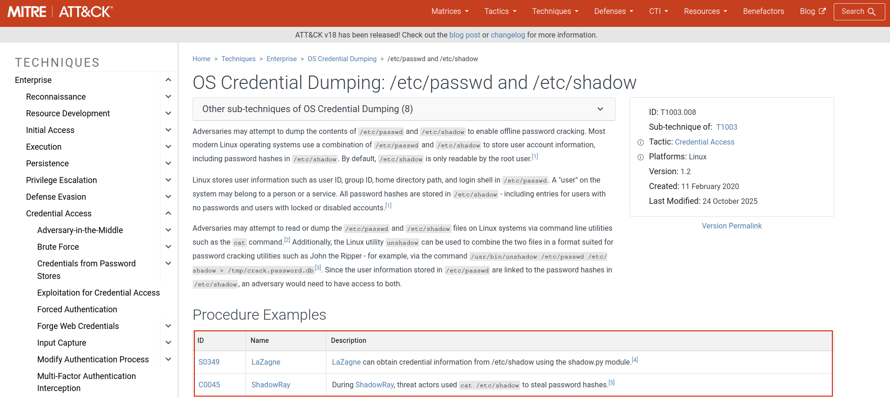

# _OVERVIEW

In `T1003.008`, Attackers dumps `/etc/shadow`, and `/etc/passwd` files. Which are highly Sensitive files that contain the hashes of user passwords, the attacker will then have to crack their hashes offline to obtain the passwords for all users on the compromised machine. In this short post, i'll be simulating this attack and detecting it using Wazuh and Atomic red team.

### T1003.008

for this lab I'm using 3 machines, one acting as the server hosting my wazuh dashboard, target that runs Ubuntu, and Kali Linux machine with invoke atomic, I will be invoking the technique on the victim machine and run Atomic on the target system.
<!-- more --> 

Observing Wazuh’s dashboard, We Immediately notice Over 50 Alerts!

we can confirm this by checking the event logs. 

From here, the recommended actions would be to recover from a restore point and change passwords for all users on the restored system.