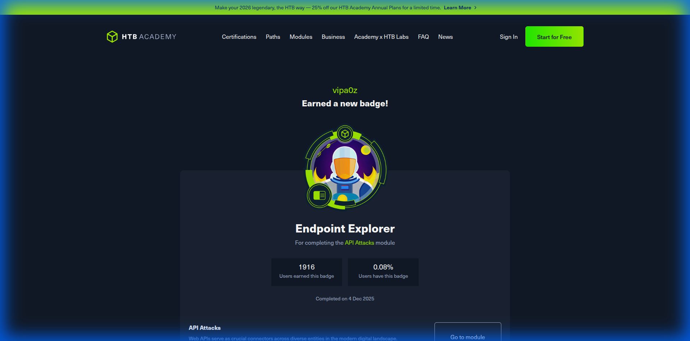
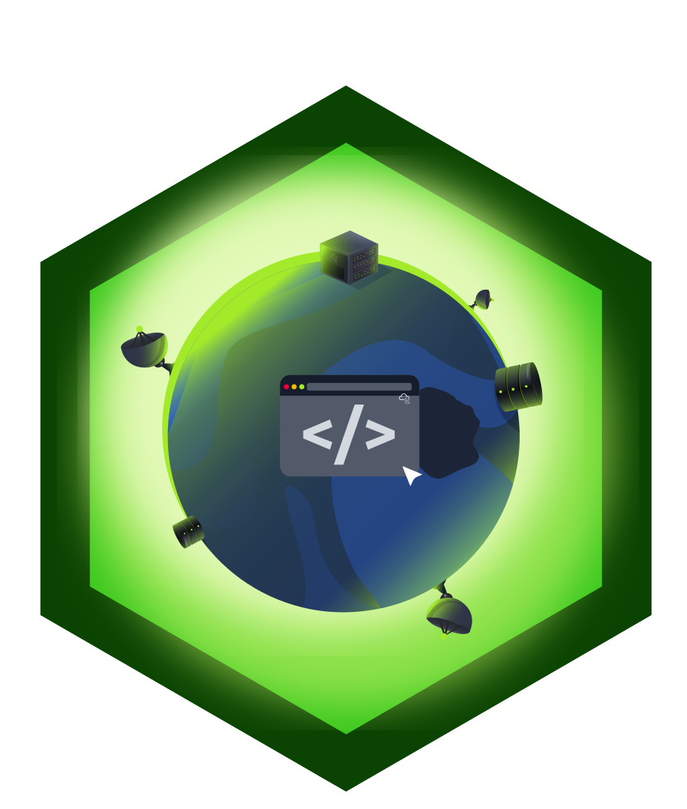

<!-- Floating TOC for recruiters -->
<!-- <nav class="about-toc">
  <h4>Quick Navigation</h4>
  <ul>
     <li><a href="#open-source">Open Source</a></li>
    <li><a href="#certifications">Certifications</a></li>
    <li><a href="#profiles">Profiles</a></li>
    <li><a href="#projects">Projects</a></li>
    <li><a href="#badges">Badges</a></li>
  </ul>
</nav> -->

---

## Thanks for being here!

I'm a Penetration Tester who loves digging into how systems work and finding creative ways to break them (for a good cause). My focus is on Securing Web Applications, APIs, Internal networks, and Active Directory. This blog is where I document my research, CTF writeups, and the things I learn along the way.

I'm always open to discussing security, collaboration, or new challenges. If you're looking for someone who is technically curious and driven by "how it works" under the hood, let's talk.

---

### Open Source Contributions

| Project                                                                                      | Description                                                                                     |
| -------------------------------------------------------------------------------------------- | ----------------------------------------------------------------------------------------------- |
| **[Ligolo-NG](https://github.com/nicocha30/ligolo-ng)** (4.1k+ ⭐)                            | I contributed a usability improvement to ligolo-ng’s autoroute feature. The tool previously didn’t reflect the last-selected interface when rebinding pivot routes, which caused friction during multi-interface pivots. I added state persistence so operators can clearly see which interface was previously selected before binding tunnel addresses. |

### Projects & Custom Tools

| Project                                                                                      | Description                                                                                     |
| -------------------------------------------------------------------------------------------- | ----------------------------------------------------------------------------------------------- |
| [Jenkins/Liferay Bind Shell](https://github.com/vipa0z/jenkins-liferay--stable-bind-shell)   | Multi-threaded Groovy bindshell for bypassing restrictive firewall rules                        |
| [Secure Network Infrastructure](https://github.com/vipa0z/DEPI-Project-small-secure-network) | Enterprise network with VLAN segmentation, dual firewalls, router-on-a-stick                    |
| [Vulnserver Exploit](https://github.com/vipa0z/vulnserver-Reverse-shell)                     | A custom Buffer Overflow exploit for a vulnerable server application                            |
| [Cheatsheet & Cookbook](https://vipa0z.github.io/cheatsheets)                                | Active Directory, Web, API, Internal Network exploitation cheatsheets, notes, and methodologies |

### Certifications

Hack The Box Certified Penetration Testing Specialist (HTB CPTS)

 

### Course Completions
| Course | Platform |
| --- | --- |
| Web Penetration Tester Path | HackTheBox |
| Penetration Tester Path | HackTheBox |
| Security Engineering Path | TryHackMe |
| Cisco CyberOps Associate | Cisco |
| Cisco Network Associate (CCNA) | Cisco |

### Profiles

<!-- 

    

 -->

<iframe src="https://tryhackme.com/api/v2/badges/public-profile?userPublicId=2114216" style="border:none; width: 400px; height: 100px;"></iframe>

### Badges

  <!-- HTB CPTS Badge -->
  
  
  <!-- Cisco CyberOps Badge -->
  
  
  <!-- Cisco CCNA Badge -->
  
  
  <!-- HTB Academy Module Badges -->
  
  
  
  
  
  
  
  
  
  
  
  
  
  
  
  
  
  
  
  
  
  
  
  
  
  
  
  
  

  <!-- TryHackMe Badges -->
  
  
  
  
  

